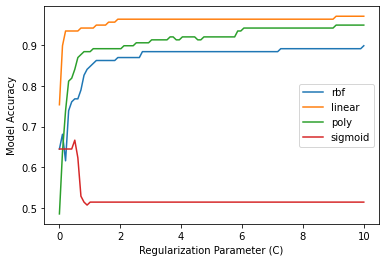

# Model Card

## Model Description

**Input:** Numerical float values.
**Output:** Binary categorical (Downs Syndrome vs Control)

**Model Architecture:** Support Vector Machine with linear kernel and internal regularization.

## Performance
Model Performance can be seen in the image below:

## Limitations
The model is trained on mouse data and should in no way be assumed to work for other animals, including humans. The dataset itself seems to have an imbedded bias due to the fact that the treatment that a mouse recieved seems to not have been totally random. The dataset is also not very large and this may be a hinderance to model reliability. 

## Trade-offs
The model performance is not great when no regularization is taken into account. High values of the regularization parameter lead to near-perfect performance, but this could also indicate overfitting. It was thus decided that the ideal value for the regularization parameter was a value of 2. 
